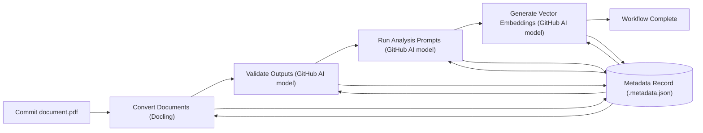
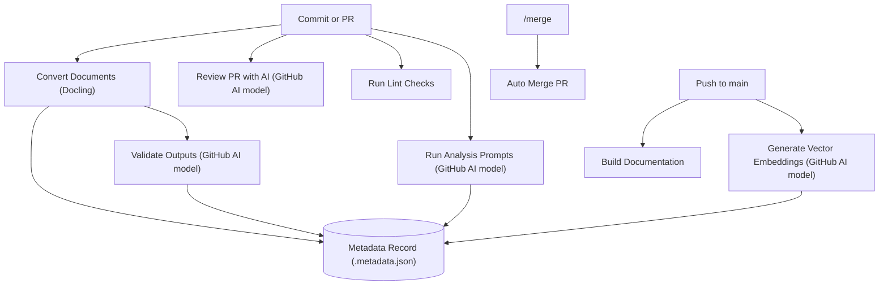

# Doc AI Starter

Doc AI Starter is a **showcase template** for building end‑to‑end document pipelines with GitHub's AI models. It helps developers new to these models structure `.prompt.yaml` files and apply them to advanced document analysis. The repository shows how to convert files, validate the output, run custom analysis prompts, generate embeddings, and review pull requests—all within the GitHub ecosystem.

The project targets both beginners and experienced developers who are new to document analysis or GitHub's AI models. Everything runs inside the GitHub ecosystem so you can see the entire pipeline—from source files to pull‑request review—in one place.
A simple commit under `data/` triggers the full pipeline—conversion, validation, analysis, and embedding—automatically.

> **Note:** The repository stores small example documents directly in Git for clarity. For production use or large datasets, extend the workflows to handle big files with [Git LFS](https://git-lfs.com/) and back them with an object storage service.

Full documentation lives in the `docs/` folder and is published at [https://alangunning.github.io/doc-ai-analysis-starter/docs/](https://alangunning.github.io/doc-ai-analysis-starter/docs/).

## Quick Start

1. **Requirements**
   - Python ≥ 3.10
   - Node ≥ 18 for building the docs (optional)
   - `GITHUB_TOKEN` for access to GitHub Models and the GitHub CLI. When creating a fine‑grained personal access token, grant **Read** access to **Models** under the account permissions tab (not the repositories tab). You can [prototype for free](https://docs.github.com/en/github-models/use-github-models/prototyping-with-ai-models)

2. **Install**

   ```bash
   pip install -e .
   ```

   Optionally build the documentation site:

   ```bash
   cd docs
   npm install
   npm run build
   cd ..
   ```

3. **Configure**

   Copy `.env.example` to `.env` and adjust variables as needed. Environment
   variables from the runtime override values in the file and command-line
   flags override both. Use `doc-ai config set VAR=VALUE` to update the `.env`
   file from the CLI and `doc-ai config show` to display current settings. The
   CLI creates or updates the file with `0600` permissions for security. See the
   [Configuration guide](https://github.com/alangunning/doc-ai-analysis-starter/blob/main/docs/content/guides/configuration.md)
   for details on workflow toggles and model settings.

4. **Try it out**

   Ensure the CLI has access to your GitHub Models token. The
   scripts call `load_dotenv()` so any `GITHUB_TOKEN` defined in
   `.env` is loaded automatically. You can also supply it inline on
   the command line:

   ```bash
   GITHUB_TOKEN=github_pat_xxxx ./doc_ai/cli.py --help
   ```

   Convert a document and validate the Markdown output:

   ```bash
   python scripts/convert.py data/sec-form-8k/apple-sec-8-k.pdf --format markdown
   python scripts/validate.py data/sec-form-8k/apple-sec-8-k.pdf data/sec-form-8k/apple-sec-8-k.pdf.converted.md
   ```

   The validator searches for a prompt file next to the inputs:

   - `<name>.validate.prompt.yaml` for a single document
   - `validate.prompt.yaml` shared by a directory

   If neither exists, it falls back to
   `.github/prompts/validate-output.validate.prompt.yaml`. Override discovery
   with `--prompt`.

   The validation script relies on the reusable helpers in
   `doc_ai.openai` to upload local files or reference remote URLs. Only PDFs
   (and images) can be attached as `input_file` entries; other formats like
   Markdown are read as plain text. Large inputs automatically switch from the
   standard `/v1/files` endpoint to the resumable `/v1/uploads` service before
   calling the Responses API. Use `OPENAI_FILE_PURPOSE` to change the upload
   purpose or set `OPENAI_USE_UPLOAD=1` to force the resumable service. Set
   `OPENAI_API_KEY` and the base URL to `https://api.openai.com/v1` to handle
   very long documents without running into token limits. For a more
   cost‑efficient run, specify a smaller model such as `gpt-4o-mini` with
   `--model`, or split oversized documents into chunks and validate them
   individually.

   Or run the whole pipeline in one go with the orchestrator CLI:

   ```bash
   doc-ai pipeline data/sec-form-8k/
   ```

   Run the CLI without arguments to enter an interactive shell with
   tab-completion for commands and options. The shell helper is provided in
   ``doc_ai.cli.interactive`` and re-exported from ``doc_ai.cli`` so it can be
   reused in other Typer-based projects.

### Shell Completion

The CLI ships with Typer's built-in completion support. Install completion for
your current shell or print the script to install manually:

```bash
# Install completion for the detected shell
doc-ai --install-completion

# Show the completion script
doc-ai --show-completion
```

Reload your shell after installing to enable tab completion for `doc-ai`.

## Programmatic Usage

The package exposes a typed API and ships a `py.typed` marker for static type
checkers.  You can query completions or launch the interactive shell from your
own scripts:

```python
from doc_ai.cli import app, get_completions, interactive_shell

get_completions(app, "co", "co")
interactive_shell(app)
```

## Directory Overview

```
doc_ai/                     # Python package
scripts/                  # CLI helpers
.github/workflows/        # CI workflows
.github/prompts/          # Prompt definitions
data/                     # Sample documents and outputs
docs/                     # Docusaurus documentation
```

`data` is organized by document type. Each folder includes a `<doc-type>.analysis.prompt.yaml` file for analysis prompts and may supply either `<name>.validate.prompt.yaml` or a shared `validate.prompt.yaml` for validation. When no custom validation prompt exists, the generic `.github/prompts/validate-output.validate.prompt.yaml` is used. Each source file has converted siblings and an optional `<name>.metadata.json` file that records which steps have completed.

Example structure:

```
data/
  sec-form-8k/
    sec-form-8k.analysis.prompt.yaml
    apple-sec-8-k.pdf
    apple-sec-8-k.pdf.converted.md
    apple-sec-8-k.pdf.converted.html
    apple-sec-8-k.pdf.converted.json
    apple-sec-8-k.pdf.converted.text
    apple-sec-8-k.pdf.converted.doctags
    apple-sec-8-k.pdf.metadata.json
  sec-form-10q/
    sec-form-10q.analysis.prompt.yaml
    apple-sec-form-10q.pdf
    apple-sec-form-10q.pdf.converted.md
    apple-sec-form-10q.pdf.converted.html
    apple-sec-form-10q.pdf.converted.json
    apple-sec-form-10q.pdf.converted.text
    apple-sec-form-10q.pdf.converted.doctags
    apple-sec-form-10q.pdf.metadata.json
  sec-form-4/
    sec-form-4.analysis.prompt.yaml
    sec-form-4.validate.prompt.yaml
    apple-sec-form-4.pdf
    apple-sec-form-4.pdf.converted.md
    apple-sec-form-4.pdf.converted.html
    apple-sec-form-4.pdf.converted.json
    apple-sec-form-4.pdf.converted.text
    apple-sec-form-4.pdf.converted.doctags
    apple-sec-form-4.pdf.metadata.json
```

## Packaging

The source distribution bundles this README and the small example documents
under `data/` so they are available without extra downloads. Links in the
README continue to point to the hosted documentation for users installing from
PyPI.

## Releases

This project uses [semantic versioning](https://semver.org/). Update
`CHANGELOG.md` and tag commits with `vMAJOR.MINOR.PATCH` (for example,
`v1.2.3`). Versions are derived automatically from these Git tags by
[setuptools-scm](https://github.com/pypa/setuptools-scm), ensuring reproducible
builds. Tagging a release triggers the CI workflow, which runs `ruff`, `pytest`,
builds the package, and publishes it to PyPI.

## Documentation

Guides for each part of the template live in the `docs/` folder and are published at [https://alangunning.github.io/doc-ai-analysis-starter/docs/](https://alangunning.github.io/doc-ai-analysis-starter/docs/). Useful starting points:

- [Introduction](https://alangunning.github.io/doc-ai-analysis-starter/docs/content/intro) – project overview and navigation
- [Workflow Overview](https://alangunning.github.io/doc-ai-analysis-starter/docs/content/workflows) – how the GitHub Actions fit together
- [CLI Scripts and Prompts](https://alangunning.github.io/doc-ai-analysis-starter/docs/content/scripts-and-prompts) – run conversions and analyses locally
- [Converter Module](https://alangunning.github.io/doc-ai-analysis-starter/docs/content/converter) – programmatic file conversion
- [GitHub Module](https://alangunning.github.io/doc-ai-analysis-starter/docs/content/github) – helpers for GitHub Models
- [OpenAI Module](https://alangunning.github.io/doc-ai-analysis-starter/docs/content/openai) – reusable file and response helpers
- [Metadata Module](https://alangunning.github.io/doc-ai-analysis-starter/docs/content/metadata) – track processing state
- [Configuration](https://alangunning.github.io/doc-ai-analysis-starter/docs/content/configuration) – environment variables and model settings
- [Pull Request Reviews](https://alangunning.github.io/doc-ai-analysis-starter/docs/content/pr-review) – automate AI feedback on PRs

## Automated Workflows

GitHub Actions tie the pieces together. Each workflow runs on a specific trigger and can be disabled with its `ENABLE_*` variable.

| Workflow | Trigger | Purpose |
| --- | --- | --- |
| Convert | Push to `data/**` | Convert new documents with Docling and commit sibling outputs |
| Validate | Push converted outputs | Compare rendered files to sources and correct mismatches |
| Analysis | Push Markdown or `*.analysis.prompt.yaml`, or manual dispatch | Run custom prompts against Markdown and upload JSON |
| Vector | Push to `main` with Markdown | Generate embeddings for search |
| PR Review | Pull request or `/review` comment | Provide AI feedback on the PR body |
| Docs | Push to `docs/**` on `main` | Build and publish the documentation site |
| Auto Merge | `/merge` issue comment | Approve and merge a pull request after review |
| Lint | Push/PR touching Python files | Run Ruff style checks |

Run Bandit locally to scan for common security issues:

```bash
python scripts/run_bandit.py
```

Each run updates the companion metadata so completed steps are skipped. See the [metadata docs](https://alangunning.github.io/doc-ai-analysis-starter/docs/content/metadata) for a full overview of the schema and available fields. Configure which steps run using the environment variables described in the [Configuration guide](https://github.com/alangunning/doc-ai-analysis-starter/blob/main/docs/content/guides/configuration.md).





For CLI usage and adding prompts, see `docs/content/scripts-and-prompts.md`.

## Scaling Up

This repository is optimized for clarity and small examples. To adapt the pipeline for larger or production workloads:

- Store bulky documents and generated artifacts in Git LFS or an external object store.
- Adjust the workflows to upload and download data from that storage rather than committing large files directly.
- Expand error handling, logging, and monitoring to fit your operational needs.

## License

MIT
