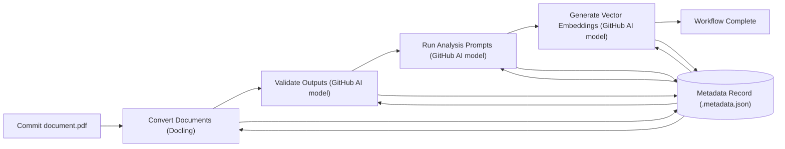
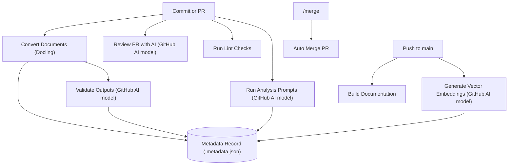

# Doc AI

Doc AI is a **showcase template** for building end‑to‑end document pipelines with GitHub's AI models. It helps developers new to these models structure `.prompt.yaml` files and apply them to advanced document analysis. The repository shows how to convert files, validate the output, run custom analysis prompts, generate embeddings, and review pull requests—all within the GitHub ecosystem.

The project targets both beginners and experienced developers who are new to document analysis or GitHub's AI models. Everything runs inside the GitHub ecosystem so you can see the entire pipeline—from source files to pull‑request review—in one place.
A simple commit under `data/` triggers the full pipeline—conversion, validation, analysis, and embedding—automatically.

> **Note:** The repository stores small example documents directly in Git for clarity. For production use or large datasets, extend the workflows to handle big files with [Git LFS](https://git-lfs.com/) and back them with an object storage service.

Full documentation lives in the `docs/` folder and is published at [https://alangunning.github.io/doc-ai-analysis-starter/docs/](https://alangunning.github.io/doc-ai-analysis-starter/docs/).

## Quick Start

1. **Requirements**
   - Python ≥ 3.10
   - Node ≥ 18 for building the docs (optional)
   - `GITHUB_TOKEN` for access to GitHub Models and the GitHub CLI. When creating a fine‑grained personal access token, grant **Read** access to **Models** under the account permissions tab (not the repositories tab). You can [prototype for free](https://docs.github.com/en/github-models/use-github-models/prototyping-with-ai-models)

2. **Install**

   ```bash
   pip install -e .
   pip install pre-commit
   pre-commit install
   pre-commit run --all-files
   ```

   Optionally build the documentation site:

   ```bash
   cd docs
   npm install
   npm run build
   cd ..
   ```

3. **Configure**

   Copy `.env.example` to `.env` and adjust variables as needed. Environment
   variables from the runtime override values in the file, the project `.env`
   overrides the global configuration file (usually
   `~/.config/doc_ai/config.json`), and command-line flags override everything.
   Use `doc-ai config set VAR=VALUE` to update the `.env` file from the CLI,
   `doc-ai config toggle KEY` to flip common booleans, and
   `doc-ai config show` to display current settings. The CLI creates or updates
   the file with `0600` permissions for security. See the
   [Configuration guide](https://github.com/alangunning/doc-ai-analysis-starter/blob/main/docs/content/guides/configuration.md)
   for details on workflow toggles and model settings.

4. **Try it out**

   Ensure the CLI has access to your GitHub Models token. The
   scripts call `load_dotenv()` so any `GITHUB_TOKEN` defined in
   `.env` is loaded automatically. You can also supply it inline on
   the command line:

   ```bash
   GITHUB_TOKEN=github_pat_xxxx ./doc_ai/cli.py --help
   ```

   Convert a document and validate the Markdown output:

   ```bash
   python scripts/convert.py data/sec-form-8k/apple-sec-8-k.pdf --format markdown
   python scripts/validate.py data/sec-form-8k/apple-sec-8-k.pdf data/sec-form-8k/apple-sec-8-k.pdf.converted.md
   ```

   Download and convert remote documents in one step:

   ```bash
   doc-ai convert --doc-type reports \
       --url https://example.com/a.pdf --url https://example.com/b.pdf
   ```

   In the interactive shell, you can add a URL directly:

   ```bash
   doc-ai> add url https://example.com/a.pdf --doc-type reports
   ```

   Load a list of links from a file or manage a stored URL list. ``urls``
   validates entries and prevents duplicates:

   ```bash
   doc-ai> add urls links.txt --doc-type reports
   doc-ai> urls reports
   ```

   Within the URL manager choose ``add`` to paste one or more links separated
   by whitespace or ``import`` to load them from a text file.

   The validator searches for a prompt file next to the inputs:

   - `<name>.validate.prompt.yaml` for a single document
   - `validate.prompt.yaml` shared by a directory

   If neither exists, it falls back to
   `.github/prompts/validate-output.validate.prompt.yaml`. Override discovery
   with `--prompt`.

   The validation script relies on the reusable helpers in
   `doc_ai.openai` to upload local files or reference remote URLs. Only PDFs
   (and images) can be attached as `input_file` entries; other formats like
   Markdown are read as plain text. Large inputs automatically switch from the
   standard `/v1/files` endpoint to the resumable `/v1/uploads` service before
   calling the Responses API. Use `OPENAI_FILE_PURPOSE` to change the upload
   purpose or set `OPENAI_USE_UPLOAD=1` to force the resumable service. Set
   `OPENAI_API_KEY` and the base URL to `https://api.openai.com/v1` to handle
   very long documents without running into token limits. For a more
   cost‑efficient run, specify a smaller model such as `gpt-4o-mini` with
   `--model`, or split oversized documents into chunks and validate them
   individually.

   Or run the whole pipeline in one go with the orchestrator CLI:

   ```bash
   doc-ai pipeline data/sec-form-8k/
   ```
   Use `--workers N` to process files concurrently and `--force` to ignore
   cached metadata when rerunning steps.

   Scaffold a new document type with template prompts:

   ```bash
   doc-ai new doc-type invoice
   ```

   This creates `data/invoice/` with `invoice.analysis.prompt.yaml`
   and `validate.prompt.yaml` based on the default templates under
   `.github/prompts/`. Any description you enter during creation is
   saved to `data/invoice/description.txt` for future reference. Use
   related commands to manage existing entries:

   ```bash
   doc-ai new rename-doc-type invoice bill
   doc-ai new delete-doc-type bill
   doc-ai new topic invoice finance
   doc-ai new rename-topic invoice finance risk
   doc-ai new delete-topic invoice risk
   ```

Run ``doc-ai`` with no arguments to drop into an interactive shell with
tab-completion for commands and options. Completions include document types
under ``data/`` and analysis topics discovered from prompt files. Use
``show doc-types`` and ``show topics`` to enumerate these entries. Use
``--no-interactive`` (or set ``doc-ai config set interactive=false``) to show
help and exit instead of starting the REPL.

By default only ``PATH`` and ``HOME`` are offered for completion. Use
``doc-ai config safe-env`` subcommands or set ``DOC_AI_SAFE_ENV_VARS`` in the
project ``.env`` or global config to explicitly allow or deny additional
variables. The value is a comma-separated list where entries prefixed with ``-``
are hidden and others are exposed. If ``DOC_AI_SAFE_ENV_VARS`` is unset and the
configuration would reveal many variables, the CLI emits a warning. For
example::

    doc-ai config safe-env add MY_API_KEY
    doc-ai config safe-env add -DEBUG_TOKEN

   #### cd command

The shell includes a ``cd`` helper to change directories without leaving the session.
It reloads any ``.env`` file and global configuration in the target directory and
refreshes completion suggestions for document types and topics:

    ```
    doc-ai> cd docs
    docs>
    ```

    The prompt reflects the current working directory and command history is
    stored under the user data directory provided by ``platformdirs`` (for
    example ``~/.local/share/doc_ai/history`` on Linux) for future sessions. The
    location can be overridden with ``DOC_AI_HISTORY_FILE`` or set to ``-`` to
    disable history entirely. Use ``:clear-history`` to truncate the history
    file during a session. The shell helper lives
    in ``doc_ai.cli.interactive`` and is re-exported from ``doc_ai.cli`` so it
    can be reused in other Typer-based projects.

    Execute a batch of commands before the shell starts with ``--init`` (alias
    ``--batch``):

    ```bash
    doc-ai --init commands.txt
    ```

    Each non-empty, non-comment line in ``commands.txt`` runs as if typed at the
    prompt before the REPL begins.

    Additional REPL helpers like ``:delete-doc-type`` and ``:delete-topic``
    manage prompt files, while ``:set-default DOC_TYPE [TOPIC]`` persists
    defaults for later commands.

    Prefix commands with ``!`` to execute them in the system shell. Output from
    the command is echoed back to the REPL and the exit status is stored in
    ``doc_ai.cli.interactive.LAST_EXIT_CODE``. Shell escapes are disabled by
    default; set ``DOC_AI_ALLOW_SHELL=true`` to enable them (the REPL warns when
    enabled). When disabled, using ``!`` emits a warning.

### Shell Completion

The CLI ships with Typer's built-in completion support. Install completion for
your current shell or print the script to install manually:

```bash
# Install completion for the detected shell
doc-ai --install-completion

# Show the completion script
doc-ai --show-completion
```

Reload your shell after installing to enable tab completion for `doc-ai`.

## Programmatic Usage

The package exposes a typed API and ships a `py.typed` marker for static type
checkers. You can launch the interactive shell from your own scripts:

```python
from pathlib import Path
from doc_ai.cli import app, interactive_shell

interactive_shell(app, init=Path("commands.txt"))
```

## Type Checking

Doc AI treats static type checking as a first-class test. All modules should
run through `mypy` without `# mypy: ignore-errors` pragmas. Run `mypy` locally
before committing to ensure a clean type-checking pass.

## Directory Overview

```
doc_ai/                     # Python package
scripts/                  # CLI helpers
.github/workflows/        # CI workflows
.github/prompts/          # Prompt definitions
data/                     # Sample documents and outputs
docs/                     # Docusaurus documentation
```

`data` is organized by document type. Each folder includes a `<doc-type>.analysis.prompt.yaml` file for analysis prompts and may supply either `<name>.validate.prompt.yaml` or a shared `validate.prompt.yaml` for validation. When no custom validation prompt exists, the generic `.github/prompts/validate-output.validate.prompt.yaml` is used. Each source file has converted siblings and an optional `<name>.metadata.json` file that records which steps have completed.

Example structure:

```
data/
  sec-form-8k/
    sec-form-8k.analysis.prompt.yaml
    apple-sec-8-k.pdf
    apple-sec-8-k.pdf.converted.md
    apple-sec-8-k.pdf.converted.html
    apple-sec-8-k.pdf.converted.json
    apple-sec-8-k.pdf.converted.text
    apple-sec-8-k.pdf.converted.doctags
    apple-sec-8-k.pdf.metadata.json
  sec-form-10q/
    sec-form-10q.analysis.prompt.yaml
    apple-sec-form-10q.pdf
    apple-sec-form-10q.pdf.converted.md
    apple-sec-form-10q.pdf.converted.html
    apple-sec-form-10q.pdf.converted.json
    apple-sec-form-10q.pdf.converted.text
    apple-sec-form-10q.pdf.converted.doctags
    apple-sec-form-10q.pdf.metadata.json
  sec-form-4/
    sec-form-4.analysis.prompt.yaml
    sec-form-4.validate.prompt.yaml
    apple-sec-form-4.pdf
    apple-sec-form-4.pdf.converted.md
    apple-sec-form-4.pdf.converted.html
    apple-sec-form-4.pdf.converted.json
    apple-sec-form-4.pdf.converted.text
    apple-sec-form-4.pdf.converted.doctags
    apple-sec-form-4.pdf.metadata.json
```

## Packaging

The source distribution bundles this README and the small example documents
under `data/` so they are available without extra downloads. Links in the
README continue to point to the hosted documentation for users installing from
PyPI.

## Releases

This project uses [semantic versioning](https://semver.org/) and
[setuptools-scm](https://github.com/pypa/setuptools-scm) to derive the version
from Git tags. To create a new release:

1. Ensure `CHANGELOG.md` has an entry for the upcoming version.
2. Run linters and tests:

   ```bash
   pre-commit run --all-files
   pytest
   ```

3. Build the package and validate metadata:

   ```bash
   python -m build
   twine check dist/*
   ```

4. Publish to PyPI:

   ```bash
   twine upload dist/*
   ```

5. Tag the commit and push the tag to trigger the release workflow:

   ```bash
   git tag -a vMAJOR.MINOR.PATCH -m "Release vMAJOR.MINOR.PATCH"
   git push --tags
   ```

## Documentation

Guides for each part of the template live in the `docs/` folder and are published at [https://alangunning.github.io/doc-ai-analysis-starter/docs/](https://alangunning.github.io/doc-ai-analysis-starter/docs/). Useful starting points:

- [Introduction](https://alangunning.github.io/doc-ai-analysis-starter/docs/content/intro) – project overview and navigation
- [Workflow Overview](https://alangunning.github.io/doc-ai-analysis-starter/docs/content/workflows) – how the GitHub Actions fit together
- [CLI Scripts and Prompts](https://alangunning.github.io/doc-ai-analysis-starter/docs/content/scripts-and-prompts) – run conversions and analyses locally
- [Converter Module](https://alangunning.github.io/doc-ai-analysis-starter/docs/content/converter) – programmatic file conversion
- [GitHub Module](https://alangunning.github.io/doc-ai-analysis-starter/docs/content/github) – helpers for GitHub Models
- [OpenAI Module](https://alangunning.github.io/doc-ai-analysis-starter/docs/content/openai) – reusable file and response helpers
- [Metadata Module](https://alangunning.github.io/doc-ai-analysis-starter/docs/content/metadata) – track processing state
- [Configuration](https://alangunning.github.io/doc-ai-analysis-starter/docs/content/configuration) – environment variables and model settings
- [Pull Request Reviews](https://alangunning.github.io/doc-ai-analysis-starter/docs/content/pr-review) – automate AI feedback on PRs
- [Plugin System](https://alangunning.github.io/doc-ai-analysis-starter/docs/content/doc_ai/plugins) – extend the CLI with custom commands, REPL commands, and completion providers; see [docs/examples/plugin_example.py](docs/examples/plugin_example.py) for a template

## Plugin Development

Create a package that exposes a `typer.Typer` app in the
`doc_ai.plugins` entry-point group:

```toml
[project.entry-points."doc_ai.plugins"]
"example" = "plugin_example:app"
```

Plugins may extend the interactive shell by calling
`doc_ai.plugins.register_repl_command` to add REPL-only commands and
`doc_ai.plugins.register_completion_provider` to supply additional
completions. See
[docs/examples/plugin_example.py](docs/examples/plugin_example.py) for a
complete example. For security, plugins are ignored unless explicitly
allowlisted. Trust a plugin by recording its version and hash:

```
doc-ai plugins trust example==1.0
doc-ai plugins trust --hash example=012345...
```

Remove a plugin from the allowlist with:

```
doc-ai plugins untrust example
```

### Plugin Trust Model

The loader inspects each plugin's distribution metadata before activation.
Plugins will only load when the ``DOC_AI_TRUSTED_PLUGINS`` configuration
specifies ``name==version`` and a matching ``name=sha256`` entry exists in
``DOC_AI_TRUSTED_PLUGIN_HASHES``. During registration, the package name,
version, and hash are verified against the allowlist; mismatches are
skipped.

### Log Redaction

Sensitive strings such as API keys are automatically masked in logs. Supply
additional comma-separated regular expressions via the
``LOG_REDACTION_PATTERNS`` configuration key to redact custom secrets.

## Automated Workflows

GitHub Actions tie the pieces together. Each workflow runs on a specific trigger and can be disabled with its `ENABLE_*` variable.

| Workflow | Trigger | Purpose |
| --- | --- | --- |
| Convert | Push to `data/**` | Convert new documents with Docling and commit sibling outputs |
| Validate | Push converted outputs | Compare rendered files to sources and correct mismatches |
| Analysis | Push Markdown or `*.analysis.prompt.yaml`, or manual dispatch | Run custom prompts against Markdown and upload JSON |
| Vector | Push to `main` with Markdown | Generate embeddings for search |
| PR Review | Pull request or `/review` comment | Provide AI feedback on the PR body |
| Docs | Push to `docs/**` on `main` | Build and publish the documentation site |
| Auto Merge | `/merge` issue comment | Approve and merge a pull request after review |
| Lint | Push/PR touching Python files | Run Ruff style checks |
| Security | Push/PR | Scan code with Bandit |

## Linting

This project uses [pre-commit](https://pre-commit.com) with [Ruff](https://github.com/astral-sh/ruff)
and [Black](https://github.com/psf/black) to keep code style consistent. Install the hooks and
run them before committing:

```bash
pre-commit install
pre-commit run --all-files
```

The hooks will sort imports, remove unused ones, and format the code.

Run Bandit locally to scan for common security issues:

```bash
bandit -r doc_ai
```

Each run updates the companion metadata so completed steps are skipped. See the [metadata docs](https://alangunning.github.io/doc-ai-analysis-starter/docs/content/metadata) for a full overview of the schema and available fields. Configure which steps run using the environment variables described in the [Configuration guide](https://github.com/alangunning/doc-ai-analysis-starter/blob/main/docs/content/guides/configuration.md).





For CLI usage and adding prompts, see `docs/content/scripts-and-prompts.md`.

## Scaling Up

This repository is optimized for clarity and small examples. To adapt the pipeline for larger or production workloads:

- Store bulky documents and generated artifacts in Git LFS or an external object store.
- Adjust the workflows to upload and download data from that storage rather than committing large files directly.
- Expand error handling, logging, and monitoring to fit your operational needs.

## License

MIT
