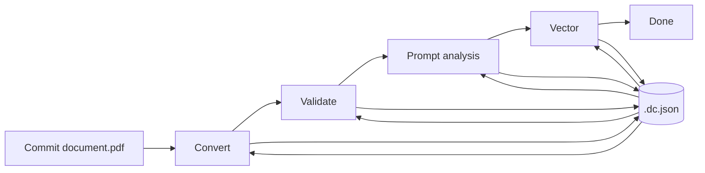
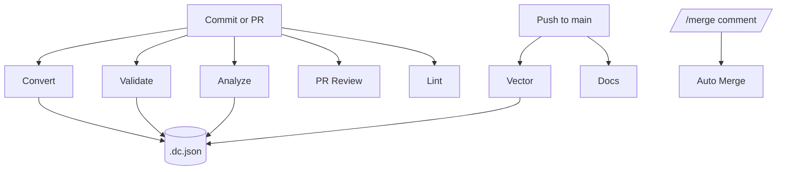

# doc-ai-analysis-starter

A minimal template for automating document conversion, verification, prompt execution, and AI-assisted pull request review using GitHub Actions and GitHub Models. The repository also provides optional utilities for working with Dublin Core metadata.

## Requirements

- Python >= 3.10
- Environment variables such as `GITHUB_TOKEN` for model access and GitHub CLI operations (see `.env.example`).

Create a `.env` file based on `.env.example` and supply your token (and optional settings). Environment variables provided by the runtime (for example via GitHub Secrets) override values in the file, allowing cloud agents to inject `GITHUB_TOKEN` automatically. Each workflow's model can be overridden by setting `PR_REVIEW_MODEL`, `VALIDATE_MODEL`, `ANALYZE_MODEL`, or `EMBED_MODEL`.

Set `DISABLE_ALL_WORKFLOWS=true` in the `.env` file to skip every GitHub Action without editing workflow files. Individual workflows remain disabled unless explicitly enabled with variables like `ENABLE_CONVERT_WORKFLOW`, `ENABLE_VALIDATE_WORKFLOW`, `ENABLE_VECTOR_WORKFLOW`, `ENABLE_PROMPT_ANALYSIS_WORKFLOW`, `ENABLE_PR_REVIEW_WORKFLOW`, `ENABLE_DOCS_WORKFLOW`, `ENABLE_AUTO_MERGE_WORKFLOW`, or `ENABLE_LINT_WORKFLOW`.

Install dependencies with:

```bash
pip install -e .
```

For the Docusaurus docs site:

```bash
cd docs
npm install
npm run build
```

## Directory layout

Each source document is stored under `data/<name>/<name>.pdf`. Conversions,
embeddings, and other derived files are written alongside the source so every
representation stays grouped together:

```
data/
  sample/
    sample.pdf
    sample.md
    sample.html
    sample.embedding.json
```

## Scripts

Each CLI tool is a thin wrapper around reusable functions in the `docai` package.
GitHub-specific helpers live under `docai.github` so the same interfaces can be
extended to other providers later.

### `convert.py`

Convert raw documents (e.g., PDFs) into one or more formats:

```bash
python scripts/convert.py data/sample/sample.pdf --format markdown --format html
```

Outputs are written alongside the source file, so the example above produces
`data/sample/sample.md` and `data/sample/sample.html`. Pass `--format` multiple
times to emit additional outputs (`json`, `text`, or `doctags`). Alternatively,
set a comma-separated list in the `OUTPUT_FORMATS` environment variable so the
script and the convert workflow default to those formats (e.g.,
`OUTPUT_FORMATS=markdown,html`). The underlying library is wrapped by
`docai.converter` so you can swap engines without changing calling code.

### `validate.py`

Validate that a converted file (Markdown, HTML, JSON, etc.) matches the original document:

```bash
python scripts/validate.py data/example/example.pdf data/example/example.md
```
Override the model with `--model` or `VALIDATE_MODEL`.

### `run_prompt.py`

Run a prompt definition against a Markdown document and save JSON output next to the source file:

```bash
python scripts/run_prompt.py prompts/annual-report.prompt.yaml data/example/example.md
```

The above writes `data/example/example.annual-report.json`. Override the model with `--model` or `ANALYZE_MODEL`.

### `build_vector_store.py`

Generate embeddings for Markdown documents and write them next to each source file:

```bash
python scripts/build_vector_store.py data
```

Embeddings are fetched from the GitHub Models API using
`openai/text-embedding-3-small` by default. Override the model with
`EMBED_MODEL`. The script sends a POST request to
`https://models.github.ai/inference/embeddings` with your `GITHUB_TOKEN` and
writes the returned float vectors to `<name>.embedding.json` files in the same
directory as each Markdown document.

### `review_pr.py`

Produce AI-assisted PR feedback using a prompt file:

```bash
python scripts/review_pr.py prompts/pr-review.prompt.yaml "PR body text"
```
Override the model with `--model` or `PR_REVIEW_MODEL`.

### `merge_pr.py`

Merge a pull request when authorized:

```bash
python scripts/merge_pr.py 123
```

### Dublin Core utilities

Reusable helpers for creating and parsing Dublin Core metadata documents:

```python
from docai.metadata import DublinCoreDocument
```

Each source file may include a sibling ``*.dc.json`` metadata record. The
metadata stores a blake2b checksum and tracks which processing steps have been
completed. A typical metadata file looks like:

```json
{
  "blake2b": "<file hash>",
  "extra": {
    "steps": {
      "conversion": true,
      "analysis": true,
      "prompt:annual-report": true,
      "vector": true
    }
  }
}
```

On each run the scripts compute the current checksum. If it matches the value
in the metadata and the relevant step is marked complete, that step is skipped.
Otherwise the step runs and the metadata file is updated so subsequent runs only
process changed or incomplete documents.



## GitHub Workflows

- **Convert** – auto-converts newly added `data/**/*.pdf` files and commits sibling format outputs, skipping files when `.dc.json` indicates conversion is complete.
- **Validate** – checks converted outputs against the source documents and auto-corrects mismatches, skipping unchanged files via metadata.
- **Vector** – generates embeddings for Markdown files on `main` and writes them next to the sources, omitting documents whose metadata already records the `vector` step.
- **Analyze** – executes prompt templates against Markdown documents and uploads JSON output as artifacts, re-running only when prompts haven't been marked complete.
- **PR Review** – runs an AI model against each pull request and posts the result as a comment, ending with `/merge` when the changes are approved.
- **Docs** – builds the Docusaurus site and deploys to GitHub Pages.
- **Auto Merge** – approves and merges pull requests when a `/merge` comment is posted. Disabled by default; enable by setting `ENABLE_AUTO_MERGE_WORKFLOW=true` in `.env`.
- **Lint** – runs Ruff to check Python code style.

The PR review prompt asks the model to append `/merge` when no further changes are required. Posting this comment triggers the Auto Merge workflow, which approves and merges the pull request.



## Adding Prompts

To add a new prompt:

1. Create a `.prompt.yaml` file in `prompts/` using the GitHub Models structure (`name`, `description`, `model`, `modelParameters`, `messages`).
2. Optionally update the `analyze.yaml` matrix to include the new prompt name if you want it to run automatically in the workflow.
No changes to the Python scripts are required.

## License

MIT
