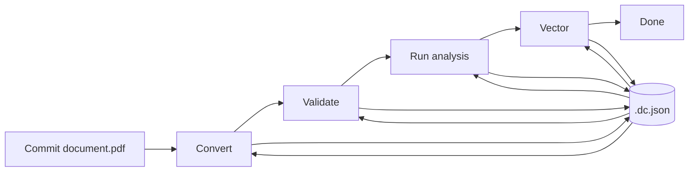
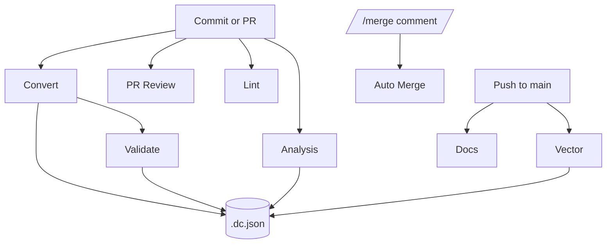

# AI Doc Analysis Starter

A minimal template for converting, validating, analyzing, and reviewing documents with GitHub Actions and GitHub Models.

## Quick start

1. **Requirements**
   - Python >= 3.10
   - `GITHUB_TOKEN` and other environment variables (see [`.env.example`](./.env.example))
2. **Setup**
   ```bash
   cp .env.example .env  # add your token
   pip install -e .
   ```
3. **Docs site (optional)**
   ```bash
   cd docs
   npm install
   npm run build
   ```

See the `docs` directory for full setup, CLI usage, and workflow details.

## Document workflow



## GitHub automation



## License

MIT
