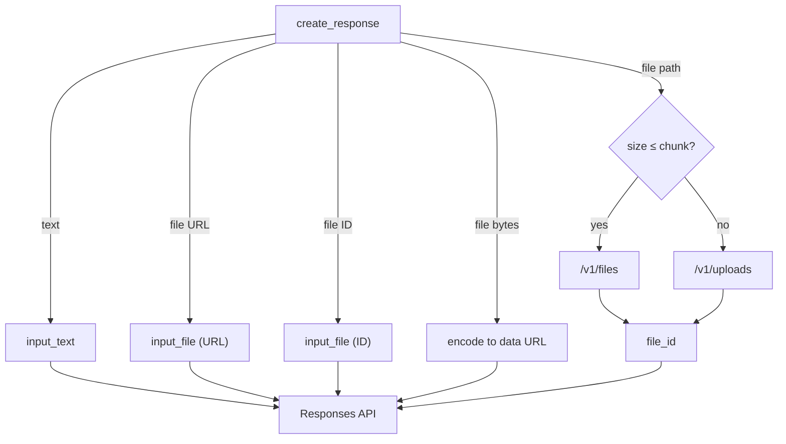

# OpenAI Module

The `doc_ai.openai` submodule bundles reusable helpers for working with
OpenAI's file and Responses APIs. It can upload local files, stream large
uploads through `/v1/uploads`, reference remote URLs directly, or encode
in-memory bytes—returning `file_id` values that integrate with the
Responses API.

### Environment overrides

Two environment variables adjust the default behaviour:

- `OPENAI_FILE_PURPOSE` – change the purpose passed to file uploads
  (defaults to `user_data`).
- `OPENAI_USE_UPLOAD` – when set to `1`, `true`, or `yes`, force all uploads
  to use the resumable `/v1/uploads` API regardless of file size.

## create_response

`create_response` assembles a request to the Responses API from any mix of
text prompts, file URLs, existing file IDs, in-memory byte strings, or
local paths. Paths are uploaded automatically via `upload_file`, which
switches between the standard `/v1/files` endpoint and the resumable
`/v1/uploads` service based on file size.

> **Note:** The Responses API only accepts PDFs (and images) as `input_file`
> attachments. Other file types should be provided as plain text or uploaded
> for retrieval via separate tools.

```python
from openai import OpenAI
from doc_ai.openai import create_response

client = OpenAI()

resp = create_response(
    client,
    model="gpt-4.1",
    texts=["what is in this file?"],
    file_urls=["https://www.berkshirehathaway.com/letters/2024ltr.pdf"],
)
print(resp.output_text)
```

## Flow



`create_response_with_file_url` wraps the common case of a single URL and
prompt. Additional helpers include:

- `upload_file` – upload a local path and return its `file_id`
- `upload_large_file` – chunked upload through `/v1/uploads`
- `input_file_from_path`, `input_file_from_url`, `input_file_from_id`,
  `input_file_from_bytes` – build individual payload objects
- `progress` callbacks – pass `progress=` to `create_response` or upload
  helpers to monitor byte transfer

Import these utilities from `doc_ai.openai` to reuse them in other
projects.
