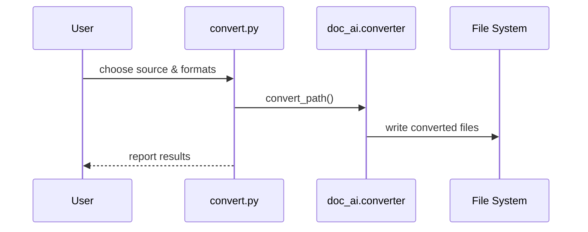
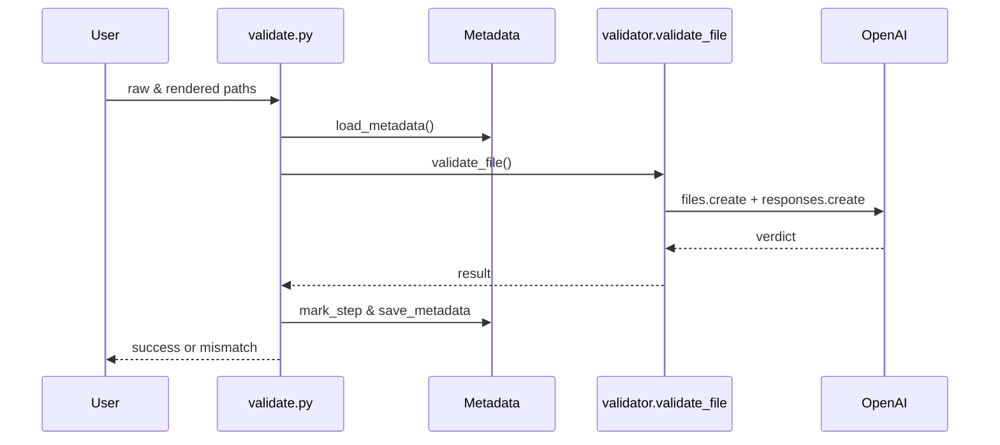
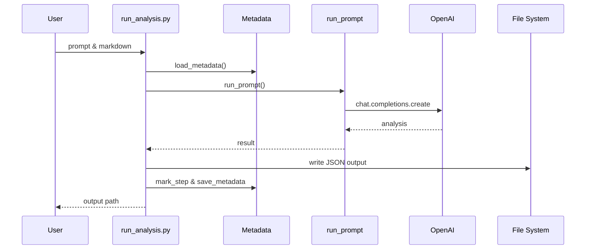
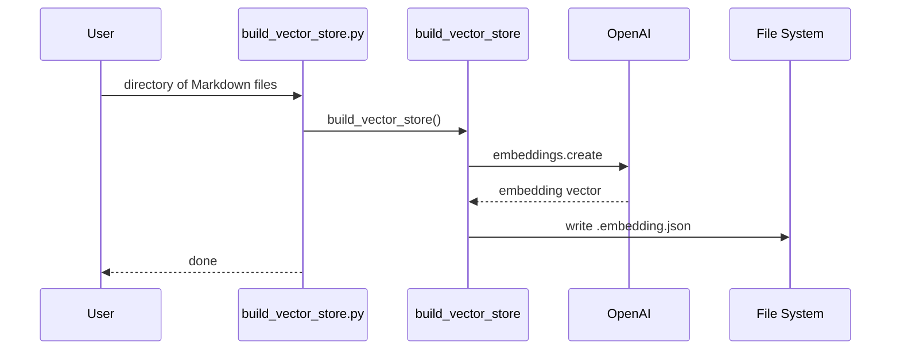
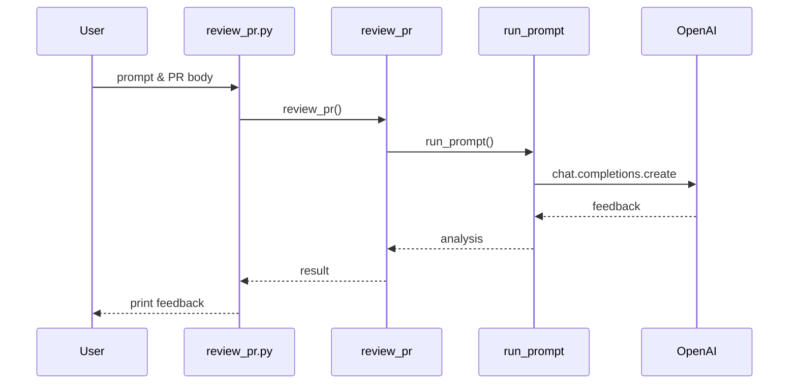
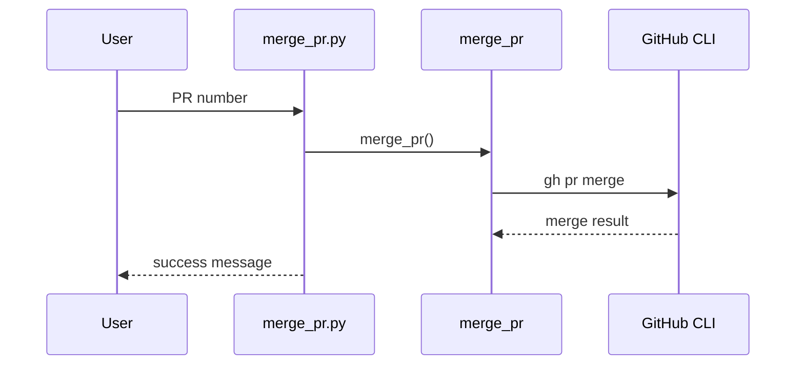

# CLI Scripts

The repository ships with small command-line utilities that expose the core features of the Python package. They can be invoked directly and are useful for prototyping outside of GitHub Actions.

> **Note:** Set the `GITHUB_TOKEN` environment variable so the scripts can
> access GitHub Models. Each script calls `load_dotenv()`, so a token in
> `.env` is loaded automatically; alternatively, pass it inline when
> invoking a command, e.g., `GITHUB_TOKEN=github_pat_xxxx ./doc_ai/cli.py`.
> Command-line flags always take precedence over environment variables and
> `.env` entries.

## convert.py
Convert raw documents (PDF, Word, slides, etc.) into one or more formats:

```bash
python scripts/convert.py data/sample/sample.pdf --format markdown --format html
```
Outputs are written next to the source. You can also set a comma-separated list in the `OUTPUT_FORMATS` environment variable (e.g., `OUTPUT_FORMATS=markdown,html`).



## validate.py
Check that a converted file matches the original document:

```bash
python scripts/validate.py data/example/example.pdf data/example/example.pdf.converted.md
```
Override the model with `--model` or `VALIDATE_MODEL`.

Behind the scenes the script uploads both files using `client.files.create` and
invokes `client.responses.create` with `input_file` attachments. GitHub Models
lack a file API, so the command automatically targets OpenAI's
`https://api.openai.com/v1` endpoint and uses the `OPENAI_API_KEY` token. This
avoids token‑overflow issues on long documents. To reduce cost you can point
`--model` to a smaller option like `gpt-4o-mini`, or split the source into
chunks and validate them separately.



## run_analysis.py
Run a prompt definition against a Markdown document and save JSON output:

```bash
python scripts/run_analysis.py data/sec-form-8k/sec-form-8k.prompt.yaml data/sec-form-8k/apple-sec-8-k.pdf.converted.md
```
The above writes `data/sec-form-8k/apple-sec-8-k.sec-form-8k.json`. Override the model with `--model` or `ANALYZE_MODEL`.



## build_vector_store.py
Generate embeddings for Markdown files and write them next to each source:

```bash
python scripts/build_vector_store.py data
```
Override the embedding model with `EMBED_MODEL`.



## review_pr.py
Produce AI-assisted feedback for a pull request using a prompt file:

```bash
python scripts/review_pr.py .github/prompts/pr-review.prompt.yaml "PR body text"
```
Override the model with `--model` or `PR_REVIEW_MODEL`.



## merge_pr.py
Merge a pull request when authorized; used by the Auto Merge workflow after an AI review:

```bash
python scripts/merge_pr.py 123
```

# Adding Prompts



Each `.prompt.yaml` defines model parameters and instructions for GitHub's AI models. Use the examples under `data/**` as starting points when crafting prompts for your own documents.

1. Create a `.prompt.yaml` file next to the document (e.g., `data/acme-report/acme-report.prompt.yaml`).
2. Commit the prompt and document; the Analysis workflow will run it automatically.

