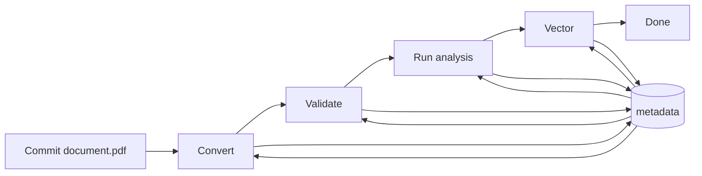
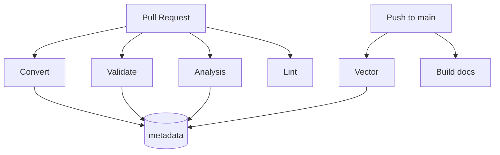

# Workflows & Metadata

GitHub Actions coordinate the document processing pipeline. Each stage writes to
or reads from a `<name>.metadata.json` sidecar so repeated runs can skip
completed work.

## Workflow overview



The sidecar captures checksums and which stages have finished.

## Pull request and main branch



Pull requests run the full pipeline except docs and embeddings, which run only
on the default branch.

## Metadata fields

`<name>.metadata.json` resembles:

```json
{
  "checksum": "...",
  "convert": true,
  "validate": false,
  "analysis": true,
  "vector": false
}
```

- **checksum** – hash of the source file
- **convert/validate/analysis/vector** – flags marking completed steps

Workflows check this file to determine whether to operate on a given document.
