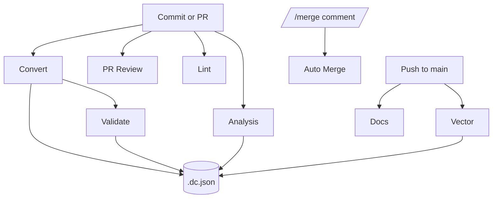

# GitHub workflows

- **Convert** – auto-converts newly added documents under `data/**` and commits sibling format outputs, skipping files when `.dc.json` indicates conversion is complete. Its commit triggers the Validate workflow.
- **Validate** – checks converted outputs against the source documents and auto-corrects mismatches, skipping unchanged files via metadata.
- **Vector** – generates embeddings for Markdown files on `main` and writes them next to the sources, omitting documents whose metadata already records the `vector` step.
- **Analysis** – auto-discovers `<doc-type>.prompt.yaml` files in each `data/<doc-type>` directory, runs them against every Markdown document in that directory, and uploads JSON output as artifacts, re-running only when prompts haven't been marked complete.
- **PR Review** – runs an AI model against each pull request and posts the result as a comment, ending with `/merge` when the changes are approved. Comment `/review` on a pull request to trigger the workflow manually.
- **Docs** – builds the Docusaurus site and deploys to GitHub Pages.
- **Auto Merge** – approves and merges pull requests when a `/merge` comment is posted. Disabled by default; enable by setting `ENABLE_AUTO_MERGE_WORKFLOW=true` in `.env`.
- **Lint** – runs Ruff to check Python code style.

The PR review prompt asks the model to append `/merge` when no further changes are required. Posting this comment triggers the Auto Merge workflow, which approves and merges the pull request. Use `/review` in a comment to re-run the PR Review workflow on demand.

