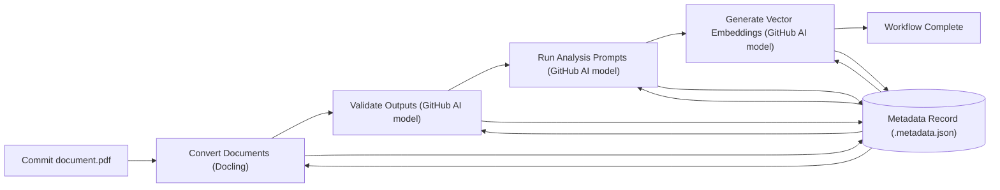

# Workflow Overview

The template's GitHub Actions coordinate the document pipeline from raw uploads to analysis results. Documents live under `data/`, grouped by form type. Each folder includes a `<doc-type>.prompt.yaml` file that defines the analysis instructions for GitHub's AI model, and each source file keeps converted siblings and metadata records. A typical layout looks like:
Committing a new file to `data/` kicks off the pipeline automatically: the Convert workflow runs first, then subsequent steps cascade based on the metadata.

> **Note:** Committing documents directly works for small examples. For larger datasets, move files to Git LFS or an external storage service and update the workflows to pull from there.

```
data/
  sec-form-8k/
    sec-form-8k.prompt.yaml
    apple-sec-8-k.pdf
    apple-sec-8-k.pdf.converted.md
    apple-sec-8-k.pdf.converted.html
    apple-sec-8-k.pdf.converted.json
    apple-sec-8-k.pdf.converted.text
    apple-sec-8-k.pdf.converted.doctags
    apple-sec-8-k.pdf.metadata.json
  sec-form-10q/
    sec-form-10q.prompt.yaml
    acme-2024-q1.pdf
    acme-2024-q1.pdf.converted.md
    acme-2024-q1.pdf.converted.html
    acme-2024-q1.pdf.converted.json
    acme-2024-q1.pdf.converted.text
    acme-2024-q1.pdf.converted.doctags
    acme-2024-q1.pdf.metadata.json
  sec-form-4/
    sec-form-4.prompt.yaml
    insider-2024-01-01.pdf
    insider-2024-01-01.pdf.converted.md
    insider-2024-01-01.pdf.converted.html
    insider-2024-01-01.pdf.converted.json
    insider-2024-01-01.pdf.converted.text
    insider-2024-01-01.pdf.converted.doctags
    insider-2024-01-01.pdf.metadata.json
```

Each workflow can run independently, but together they form an end-to-end process:

- **Convert** – convert new documents under `data/**` using Docling and commit sibling outputs.
- **Validate** – use the GitHub AI model to compare converted files to sources and correct mismatches.
- **Analysis** – run `<doc-type>.prompt.yaml` against Markdown documents with the GitHub AI model and upload JSON.
- **Vector** – generate embeddings for Markdown files on `main` with the GitHub AI model.
- **PR Review** – review pull requests with the GitHub AI model; comment `/review` to rerun.
- **Docs** – build the Docusaurus site.
- **Auto Merge** – after an AI review, a `/merge` comment triggers the workflow to auto‑approve and merge the pull request with the GitHub AI model (disabled by default).
- **Lint** – run Ruff for Python style.

The table below shows when each workflow runs and how to toggle it:

| Workflow | Trigger | Env toggle |
| --- | --- | --- |
| Convert | Push to `data/**` | `ENABLE_CONVERT_WORKFLOW` |
| Validate | Push converted outputs | `ENABLE_VALIDATE_WORKFLOW` |
| Analysis | Push Markdown or `.prompt.yaml`, or manual dispatch | `ENABLE_PROMPT_ANALYSIS_WORKFLOW` |
| Vector | Push to `main` with Markdown | `ENABLE_VECTOR_WORKFLOW` |
| PR Review | Pull request or `/review` comment | `ENABLE_PR_REVIEW_WORKFLOW` |
| Docs | Push to `docs/**` on `main` | `ENABLE_DOCS_WORKFLOW` |
| Auto Merge | `/merge` issue comment | `ENABLE_AUTO_MERGE_WORKFLOW` |
| Lint | Push/PR touching Python files | `ENABLE_LINT_WORKFLOW` |

Each step updates the document's `<name>.metadata.json` record so completed work is skipped on subsequent runs.


